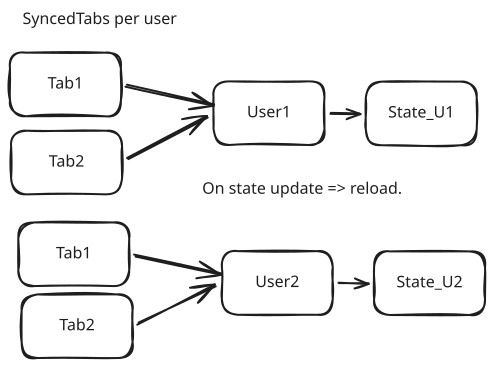
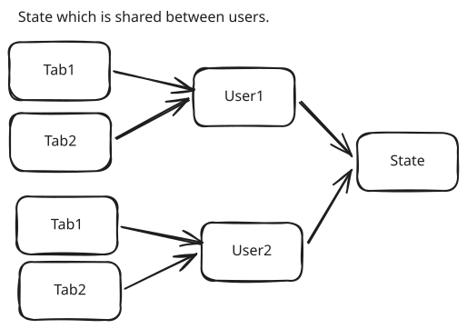
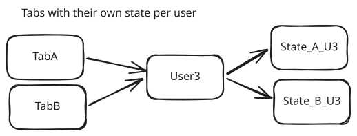

# Synced tabs and shared state

When do we have a use case to have synchronised tabs??  
It would be cool to have an application in which you can cooperate on documents.  
Or you could have a chat, on multiple tabs, and want to have the same state of the message-edit-box.    
However, it is a difficult problem to solve. For documents, it is mostly done through document-versioning.

## Like event sourcing

If you look at architecture here, it is a bit like stream-based architecture. There are changes coming in, possibly from multiple users or sources. And we want to keep a single source of truth. If we store events, all changes are stored and selectable for merge. Something along those lines.

Think about it like Xerbutri-cms. In some objects, it updates per field.  

Whenever an object changes => stream the updates. You can do that on any user input, or a timer.

In the backend, I could collect the changes as events, replay them and create a state.  

In that case, all scenario's below, kind of merge-into-one.
Because it no longer matters if the user is in one tab, or multiple tabs. There's just these update events, and they can be handled by diff comparisons.

## Scenario 1: Having a shared app state

Use a shared AppState. This is a bit like "Settings", those things are loaded once, and reused in the full app.

## Scenario 2, one user with multiple tabs that should be in sync. State per user.

One user with multiple tabs, should have the same state in all tabs.

## Scenario 3, two users sharing the same state.

Where the state should be kept in sync.

## Scenario 4: some states are not shared.

## Thinking about it.

Content management system.

There are pages.
Pages have (possibly shared) content blocks.

So, the states mentioned can even be mixed!

In the end, they are all objects.

Yes.

The state is a snapshot of an in-memory object, or a snapshot of events.

The idea is to store the events. ObjectId, FieldId, Timestamp, Value, UserId.

Then, you can replay the events to get the current state of the object.

I am having a stream.

I can subscribe to a stream, and filter on the objectId.

